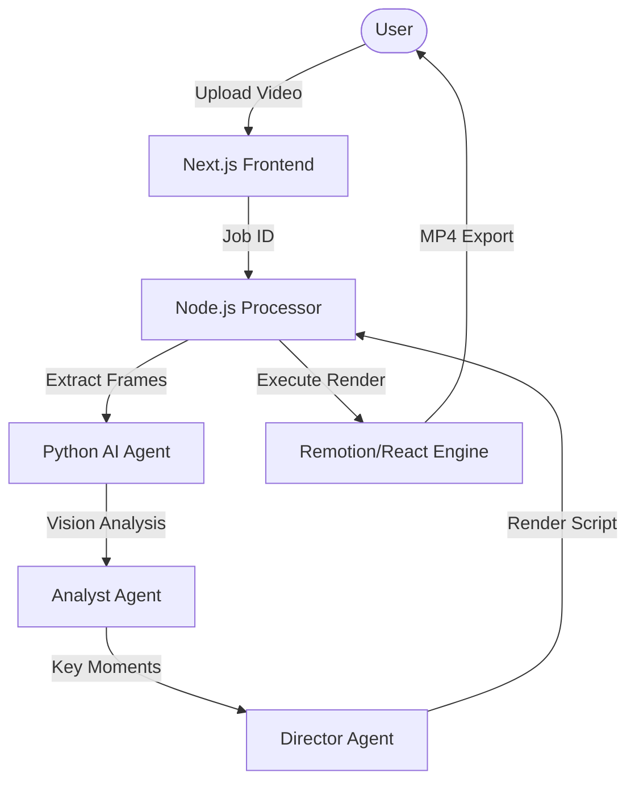

# Rendrift 🎬
### Professional AI-Powered Cinematic Video Generator

Rendrift transforms raw, boring screen recordings into professional, cinematic product demos. Using a dual-agent AI pipeline and a high-end rendering engine, it automatically adds dynamic zoom, 3D perspective, and smooth camera tracking to your videos.

 *(Note: Placeholder image URL)*

---

## ✨ Key Features

- **Virtual Cinematography**: AI agents (Analyst & Director) work together to plan camera movements, lead-in shots, and momentum-based transitions.
- **Smart Focus Tracking**: Automatically follows cursor movements and UI interactions with professional easing.
- **3D Perspective Rendering**: Adds depth, tilt, and floating effects to flat recordings.
- **Stitch Design System**: A premium, glassmorphism-inspired UI with fluid animations.
- **Automated Workflow**: Just upload your raw video and get a polished masterpiece in under 3 minutes.

## 🛠️ Tech Stack

- **Frontend**: Next.js 14, Tailwind CSS, Framer Motion
- **Backend**: Node.js, Express, Better-SQLite3
- **AI Core**: Python, FastAPI, OpenAI/Llama-3 (via OpenRouter)
- **Render Engine**: Remotion (React-based video rendering)
- **Motion Tracking**: OpenCV & GPT-4 Vision

---

## 🚀 Quick Start

### 1. Prerequisites
- Node.js (v18+)
- Python (3.12+)
- FFmpeg

### 2. Clone & Install
```bash
git clone https://github.com/anasdevai/rendrift.git
cd rendrift
```

#### Install Backend & Agent
```bash
cd apps/processor
npm install
cd agent
pip install -r requirements.txt
```

#### Install Frontend
```bash
cd ../../web
npm install
```

### 3. Configuration
Create a `.env` file in `apps/processor/`:
```env
OPENROUTER_API_KEY=your_key_here
AGENT_SERVER_URL=http://localhost:8000
DB_PATH=./db/focuscast.db
```

### 4. Run Everything
Total of 3 terminals:
1. **Backend**: `cd apps/processor && node index.js`
2. **AI Agent**: `cd apps/processor/agent && uv run python main.py`
3. **Frontend**: `cd apps/web && npm run dev`

---

## 📖 Architecture



## 📜 License
MIT © 2026 Anas Dev AI

---
*Built with ❤️ by the Rendrift Team*
